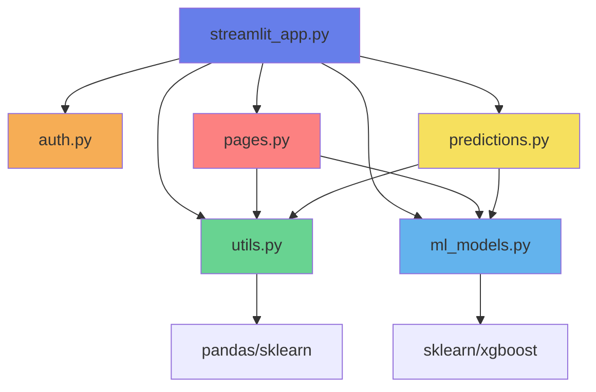

# Code Architecture Overview

## 📁 File Organization

```
┌─────────────────────────────────────────────────────────────────┐
│                     streamlit_app.py (Main)                      │
│  • Page config                                                   │
│  • CSS styling                                                   │
│  • Navigation routing                                            │
│  • Session check                                                 │
└───────────────────┬─────────────────────────────────────────────┘
                    │
        ┌───────────┼───────────┬──────────────┬─────────────┐
        │           │           │              │             │
        ▼           ▼           ▼              ▼             ▼
┌──────────┐ ┌──────────┐ ┌───────────┐ ┌──────────┐ ┌─────────────┐
│ auth.py  │ │ utils.py │ │ml_models  │ │ pages.py │ │predictions  │
│          │ │          │ │   .py     │ │          │ │   .py       │
├──────────┤ ├──────────┤ ├───────────┤ ├──────────┤ ├─────────────┤
│Login     │ │Load data │ │Get models │ │Dashboard │ │Manual pred  │
│Logout    │ │Preprocess│ │Train      │ │Training  │ │CSV pred     │
│Init sess │ │Export    │ │Predict    │ │Comparison│ │Visualize    │
└──────────┘ └────┬─────┘ └─────┬─────┘ └────┬─────┘ └──────┬──────┘
                  │              │            │               │
                  └──────────────┴────────────┴───────────────┘
                                 │
                          ┌──────▼──────┐
                          │ Session     │
                          │ State       │
                          │ (Streamlit) │
                          └─────────────┘
```

## 🔄 Data Flow

### 1. Authentication Flow
```
User → Login Form → auth.show_login_page()
                           ↓
                    Validate credentials
                           ↓
                    Set session_state.authenticated = True
                           ↓
                    Redirect to Dashboard
```

### 2. Data Loading Flow
```
App Start → utils.load_data() [@st.cache_data]
                    ↓
            Load CSV from URL
                    ↓
            Store in session_state.data
                    ↓
            Available to all pages
```

### 3. Model Training Flow
```
User selects models → pages.show_model_training()
                              ↓
                      utils.preprocess_data()
                              ↓
                      • Encode categories
                      • Scale features
                      • Train/test split
                              ↓
                      ml_models.train_models()
                              ↓
                      Store in session_state.trained_models
                              ↓
                      Display results
```

### 4. Prediction Flow (Manual)
```
User inputs params → predictions.show_manual_prediction()
                              ↓
                     utils.prepare_prediction_features()
                              ↓
                     • Encode inputs
                     • Match feature order
                              ↓
                     session_state.scaler.transform()
                              ↓
                     ml_models.make_prediction()
                              ↓
                     • Predict with all models
                     • Ensemble voting
                     • Calculate probabilities
                              ↓
                     Display results
```

### 5. Prediction Flow (CSV)
```
User uploads CSV → predictions.show_csv_prediction()
                              ↓
                     Read CSV file
                              ↓
                     For each row:
                       ↓
                       utils.prepare_prediction_features()
                       ↓
                       ml_models.make_prediction()
                              ↓
                     Aggregate results
                              ↓
                     Create visualizations
                              ↓
                     Offer CSV download
```

## 🎯 Module Responsibilities

| Module | Lines | Purpose | Key Exports |
|--------|-------|---------|-------------|
| `streamlit_app.py` | 120 | Entry point & routing | - |
| `auth.py` | 85 | Authentication | `show_login_page()`, `logout()`, `init_session_state()` |
| `utils.py` | 150 | Data processing | `load_data()`, `preprocess_data()`, `prepare_prediction_features()` |
| `ml_models.py` | 75 | ML operations | `train_models()`, `make_prediction()`, `get_models_dict()` |
| `pages.py` | 280 | Page components | `show_dashboard()`, `show_model_training()`, `show_model_comparison()` |
| `predictions.py` | 240 | Prediction UI | `show_predictions()`, `show_manual_prediction()`, `show_csv_prediction()` |

**Total:** ~950 lines (down from 1,115)

## 📊 Component Dependencies



## 🔐 Session State Variables

| Variable | Type | Module | Purpose |
|----------|------|--------|---------|
| `authenticated` | bool | auth | Login status |
| `username` | str | auth | Current user |
| `data` | DataFrame | utils | Loaded dataset |
| `trained_models` | dict | ml_models | Trained model instances |
| `model_results` | dict | ml_models | Training metrics |
| `scaler` | StandardScaler | utils | Feature scaler |
| `label_encoders` | dict | utils | Category encoders |
| `feature_names` | list | utils | Feature list |
| `X_train, X_test` | ndarray | utils | Training data |
| `y_train, y_test` | Series | utils | Target data |

## 🚀 Usage Examples

### Adding a New Model
```python
# In ml_models.py
from sklearn.ensemble import GradientBoostingClassifier

def get_models_dict():
    return {
        # ... existing models ...
        'Gradient Boosting': GradientBoostingClassifier(n_estimators=100)
    }
```

### Adding a New Page
```python
# 1. Create function in pages.py
def show_new_page(df):
    st.title("New Page")
    # page content...

# 2. Import in streamlit_app.py
from pages import ..., show_new_page

# 3. Add to navigation
page = st.radio("Select Page", 
    ["Dashboard", "Training", "Comparison", "Predictions", "New Page"])

# 4. Add routing
elif page == "New Page":
    show_new_page(df)
```

### Custom Preprocessing
```python
# In utils.py, modify preprocess_data()
def preprocess_data(df, test_size=0.2, random_state=42):
    # ... existing code ...
    
    # Add new feature engineering
    df['custom_feature'] = df['col1'] * df['col2']
    
    # Add to feature_columns
    feature_columns.append('custom_feature')
    
    # ... rest of code ...
```

## 📈 Before vs After

### Before (Monolithic)
```
streamlit_app.py: 1,115 lines
├── Imports (25 lines)
├── Config (70 lines)
├── Session state (30 lines)
├── Auth functions (60 lines)
├── Data functions (150 lines)
├── ML functions (100 lines)
├── Dashboard (200 lines)
├── Training page (150 lines)
├── Comparison page (100 lines)
└── Predictions page (230 lines)
```

### After (Modular)
```
6 files, 950 total lines:
├── streamlit_app.py (120 lines) - Routing
├── auth.py (85 lines) - Authentication
├── utils.py (150 lines) - Data ops
├── ml_models.py (75 lines) - ML ops
├── pages.py (280 lines) - UI pages
└── predictions.py (240 lines) - Predictions
```

## ✅ Refactoring Checklist

- [x] Split authentication into `auth.py`
- [x] Extract data utilities to `utils.py`
- [x] Separate ML logic to `ml_models.py`
- [x] Move page components to `pages.py`
- [x] Create predictions module `predictions.py`
- [x] Simplify main `streamlit_app.py`
- [x] Remove all duplicate code
- [x] Verify no import errors
- [x] Test all functionality
- [x] Create documentation
- [x] Backup original file

## 🎓 Best Practices Applied

1. **Single Responsibility Principle**: Each module has one clear purpose
2. **DRY (Don't Repeat Yourself)**: Shared utilities in one place
3. **Separation of Concerns**: UI, logic, and data are separate
4. **Modularity**: Easy to modify, test, and extend
5. **Clear Naming**: Function and module names describe their purpose
6. **Documentation**: Docstrings and comments explain complex logic
